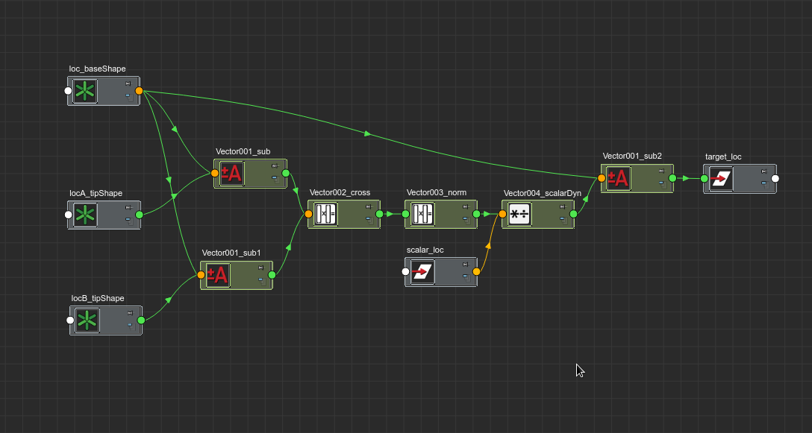

Getting started
===============

Hi this is a series of demos and tutorials to get up and running with the 
mMath library.

DEMO 1: Perpendicular vector
----------------------------

One of the things that happens often is to be able to find a vector that is perpendicular
to two other vectors which constrianis the movevent, it might be the perperdincular 
vector to a normal of a surface and an aim, usually that will be used to build a final
matrix.
In this example I will show you a snippet of code to achieve that result

.. code-block:: python

   #Here we inizalize three vectors and a scalar
   vecBase = nVec.NVec("loc_base.worldPosition","test")
   vecA = nVec.NVec("locA_tip.worldPosition","test")
   vecB = nVec.NVec("locB_tip.worldPosition","test")
   scalV = nVec.NScalar("scalar_loc.ty","scal")

   #here we extract two vectors( baseToA and baseToB)
   vec1 = vecA - vecBase
   vec2 = vecB - vecBase

   #we compute the cross product
   cross = vec1 ^ vec2
   #normalizing the result
   norm = cross.normalize()
   #summing the scaled perpendicular vector to the base
   final = vecBase + norm.scalar_dynamic(scalV)
   #connectiong to a locator to show the result
   final.connect_to("target_loc.t")

This is the result in the node editor

Many operators are implemented which allows to achieve complex inline operation like:

.. code-block:: python

   final = vecBase + (2*(-norm).scalar_dynamic(scalV))

In this line there are many operation happening at once, the first one is the  negation
of the vector, then the vector gets dynamically scaled, statically scaled and finally
summed to the result, for more information on static vs dynamic scalar operation 
please refer to : :ref:`Static vs scalar operation <static-dynamic>`

Now I will perform the same operation using the regular pure math side of the library and 
you will see the code is fairly similar:

.. code-block:: python

   locBaseL = cmds.getAttr("loc_base.worldPosition")[0]
   locAL = cmds.getAttr("locA_tip.worldPosition")[0]
   locBL = cmds.getAttr("locB_tip.worldPosition")[0]
   scalV = cmds.getAttr("scalar_loc.ty")
   vecBase = vec.Vec(locBaseL)
   vecA = vec.Vec(locAL)
   vecB = vec.Vec(locBL)

   vec1 = vecA - vecBase
   vec2 = vecB - vecBase

   cross = vec1 ^ vec2
   norm = cross.normalize()
   final = vecBase + (scalV*2*(-norm))

As you can see only the initialization of the vectors itself is different, all the rest
is the same, the only missing bits is the scalar_dynamic call which doesn't exists in the 
pure math implementation, the reason why is explained here : :ref:`Static vs scalar operation <static-dynamic>`

Finally we can compare both codes:

.. code-block:: python

   locBase = "loc_base.worldPosition"
   locA = "locA_tip.worldPosition"
   locB = "locB_tip.worldPosition"
   target = "target_loc.t"
   scalar = "scalar_loc.ty"

   vecBase = nVec.NVec(locBase,"test")
   vecA = nVec.NVec(locA,"test")
   vecB = nVec.NVec(locB,"test")
   scalV = nVec.NScalar(scalar,"scal")
   vec1 = vecA - vecBase
   vec2 = vecB - vecBase

   cross = vec1 ^ vec2
   norm = cross.normalize()
   final = vecBase + (2*(-norm).scalar_dynamic(scalV))
   final.connect_to(target)
   print final.as_list()

   locBaseL = cmds.getAttr("loc_base.worldPosition")[0]
   locAL = cmds.getAttr("locA_tip.worldPosition")[0]
   locBL = cmds.getAttr("locB_tip.worldPosition")[0]
   scalV = cmds.getAttr("scalar_loc.ty")
   vecBase = vec.Vec(locBaseL)
   vecA = vec.Vec(locAL)
   vecB = vec.Vec(locBL)

   vec1 = vecA - vecBase
   vec2 = vecB - vecBase

   cross = vec1 ^ vec2
   norm = cross.normalize()
   final = vecBase + (scalV*2*(-norm))
   print final.as_list()

if we run this code we will get this output:

.. code-block:: python

   [-9.92186164855957, 3.0812413692474365, 7.610930442810059]
   [-9.921861257927038, 3.081241399214411, 7.610930208516201]

As you can see the results are the same (just some rounding differences)

Here if you like it better a step by step video:

.. raw:: html

   <iframe src="https://player.vimeo.com/video/121407853" width="500" height="280" frameborder="0" webkitallowfullscreen mozallowfullscreen allowfullscreen></iframe> 
<a href="https://vimeo.com/121407853">mMath Lib: Demo1 - Perpendicular vector</a> from <a href="https://vimeo.com/marcogiordano91">Marco Giordano</a> on <a href="https://vimeo.com">Vimeo</a>.

DEMO 2: Stretchy IK
----------------------------
In this second demo we are going to takle a more rigging related task, a stretchy IK.
This demo will allow us to show better the use of vectors and scalars working toghether.

Here is the snippet of code:

.. code-block:: python

   #declaring the chain array
   chain =["joint1","joint2","joint3"]
   #declaring initial vectors
   startV = nVec.NVec("start_drv.worldPosition", "sStretch")
   endV = nVec.NVec("end_drv.worldPosition", "eStretch")
   poleV = nVec.NVec("poleVec_drv.worldPosition", "pStretch")

   #declaring needed stretch scalar for the setup
   stretchV= nVec.NScalar("end_drv.stretch","stretch")

   #computing the length between the end and the start of the chain
   distV = endV - startV
   length = distV.length()

   #getting initial chain length and converting into vectors
   upLen = cmds.getAttr(chain[1] + '.tx')
   lowLen = cmds.getAttr(chain[2] + '.tx')

   #here we create two working vector from static values
   #the static value will be hardcoded in a transfomr channel
   #and a NScalar instance will be returned
   upLenV = nVec.NScalar.from_value(upLen, "upLen")
   lowLenV = nVec.NScalar.from_value(lowLen, "lowLen")

   #getting total length chain (this can be easily multiplied by the global scale)
   initLen = upLenV+lowLenV

   #finding theratio
   ratio = length /initLen

   #calculating scaled length
   scaledUp = upLenV * ratio
   scaledlow = lowLenV * ratio

   #computing final blended stretch
   finalScaledUp = upLenV.blend(scaledUp, stretchV)
   finalScaledLow = lowLenV.blend(scaledlow,stretchV)

   #condition node (old school)
   cnd = cmds.createNode("condition")
   ratio.connect_to(cnd + '.firstTerm')
   cmds.setAttr(cnd + '.secondTerm' ,1)
   cmds.setAttr(cnd + '.operation', 3)

   #connecting our final calculaded stretch node to the cnd colors
   finalScaledUp.connect_to(cnd + '.colorIfTrueR')
   upLenV.connect_to(cnd + '.colorIfFalseR')
   finalScaledLow.connect_to(cnd + '.colorIfTrueG')
   lowLenV.connect_to(cnd + '.colorIfFalseG')

   cmds.connectAttr(cnd + '.outColorR', chain[1] + '.tx')
   cmds.connectAttr(cnd + '.outColorG', chain[2] + '.tx')

As you can see with really few lines of code we created a fully functioning 
stretchy IK setup.

This is the result in the node editor

.. image:: images/demo2.png

Here a step by step video showing the process:

.. raw:: html

   <iframe src="https://player.vimeo.com/video/121556271" width="500" height="281" frameborder="0" webkitallowfullscreen mozallowfullscreen allowfullscreen></iframe> 
<a href="https://vimeo.com/121556271">Desktop 03.07.2015 - 18.55.48.04</a> from <a href="https://vimeo.com/marcogiordano91">Marco Giordano</a> on <a href="https://vimeo.com">Vimeo</a>.

DEMO 3: Lock-Stretchy IK
----------------------------
In this demo we are going to expand on the previous code and add a lock to elbow
feature to our stretchy IK.
In the code I will put toghether both old and new code, so you can see how it ties
up one to the other.

Here the code:

.. code-block:: python
   
   #OLD CODE 
   #declaring the chain array   
   chain =["joint1","joint2","joint3"]
   #declaring initial vectors
   startV = nVec.NVec("start_drv.worldPosition", "sStretch")
   endV = nVec.NVec("end_drv.worldPosition", "eStretch")
   poleV = nVec.NVec("poleVec_drv.worldPosition", "pStretch")
   stretchV= nVec.NScalar("end_drv.stretch","stretch")
   lockV= nVec.NScalar("end_drv.lock","lock")

   #computing the length between the end and the start of the chain
   distV = endV - startV
   length = distV.length()

   #getting initial chain length and converting into vectors
   upLen = cmds.getAttr(chain[1] + '.tx')
   lowLen = cmds.getAttr(chain[2] + '.tx')

   #here we create two working vector from static values
   #the static value will be hardcoded in a transfomr channel
   #and a NScalar instance will be returned
   upLenV = nVec.NScalar.from_value(upLen, "upLen")
   lowLenV = nVec.NScalar.from_value(lowLen, "lowLen")

   #getting total length chain (this can be easily multiplied by the global scale)
   initLen = upLenV+lowLenV

   #finding theratio
   ratio = length /initLen

   #calculating scaled length
   scaledUp = upLenV * ratio
   scaledlow = lowLenV * ratio

   #computing final blended stretch
   finalScaledUp = upLenV.blend(scaledUp, stretchV)
   finalScaledLow = lowLenV.blend(scaledlow,stretchV)

   #condition node (old school)
   cnd = cmds.createNode("condition")
   ratio.connect_to(cnd + '.firstTerm')
   cmds.setAttr(cnd + '.secondTerm' ,1)
   cmds.setAttr(cnd + '.operation', 3)

   #connecting our final calculaded stretch node to the cnd colors
   finalScaledUp.connect_to(cnd + '.colorIfTrueR')
   upLenV.connect_to(cnd + '.colorIfFalseR')
   finalScaledLow.connect_to(cnd + '.colorIfTrueG')
   lowLenV.connect_to(cnd + '.colorIfFalseG')

   #FROM HERE THE NEW STUFF

   #now compute the pole vector lock
   #get polevec vectors
   upPoleVec = poleV - startV
   lowPoleVec = poleV - endV

   #computing the length
   upPoleLen = upPoleVec.length()
   lowPoleLen= lowPoleVec.length()

   #blending default length with poleVec vectors
   upPoleBlen = upLenV.blend(upPoleLen, lockV)
   lowPoleBlen = lowLenV.blend(lowPoleLen, lockV)

   #connecting a NScalar to the output of the node
   finalStrUp = nVec.NScalar(cnd + '.outColorR')
   finalStrLow = nVec.NScalar(cnd + '.outColorG')

   #blending the stretch and lock lengths
   resUp = finalStrUp.blend(upPoleBlen,lockV)
   resLow =finalStrLow.blend(lowPoleBlen,lockV)

   #connect final result
   resUp.connect_to(chain[1] + '.tx')
   resLow.connect_to(chain[2] + '.tx')

Here we see how with few lines we could add extra features to the previous setup,
also we could see that we can easly hook up NScalars to existing attribute that 
are not direcly supported by the library (like condition nodes), and merge them
into the existing flow

As usual here a step by step video:

.. raw:: html

   <iframe src="https://player.vimeo.com/video/121556792" width="500" height="281" frameborder="0" webkitallowfullscreen mozallowfullscreen allowfullscreen></iframe> 
<a href="https://vimeo.com/121556792">mMath Lib: Demo3 - Lock-Stretchy IK</a> from <a href="https://vimeo.com/marcogiordano91">Marco Giordano</a> on <a href="https://vimeo.com">Vimeo</a>.

  